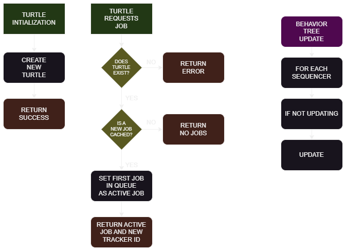

## ComputerCraft Turtle BotNet

ComputerCraft Turtles that self-replicate by mining their own resources and crafting the necessary components for new turtles to be created.

After several turtles have been created, it starts another system which acts as a complex 'hive' mind that has leader-driven behavior.
This will give turtles specific jobs, such as farming trees, mining resources, crafting materials, smelting resources, etc.

This only takes effect after a threshold of turtles have been replicated.

## How It Works

For this implementation of the system, I have **python** handle the majority of the calculations, behaviors and procedures of the turtles.

For the turtles, I make them simply connect to the python webserver using websockets to pull the turtle's next job, and I keep state persistence inside the turtle for when they are chunk unloaded and loaded, as the turtle's virtual machine is reloaded, and parse the action then return the results.

The following high-level diagram shows this complete turtle-perspective process of it connecting to the python server.

</img>

Here is a perspective of the server-side when the turtle connects to the python websocket:
</img>

For the python backend, there is many pieces to the puzzle, so here is quick list of components:
1. **CORE COMPONENTS:**
	<ul>
		<li>Websocket Wrapper</li>
		<li>Behavior Tree System</li>
		<li>Recipe Resolver</li>
		<li>Asynchronous Operations</li>
	</ul>

2. **EXTRA COMPONENTS:**
	<ul>
		<li>3D World Visualizer</li>
		<li>Fully Serializable</li>
	</ul>

And here is a version of the turtle behavior tree diagram for when the turtles are *first starting off*:
</img>

The HIVE behavior tree has not been implemented yet and will be in the future once this base system is complete and the turtles have the capacity to replicate.

...

...

## Installation

#### Python
1. Have any version of `python 3` installed.
2. Run `pip install -r requirements.txt`

#### ComputerCraft
1. Install `ComputerCraft` or `ComputerCraft:Tweaked`; any version is supported that has `websockets`.

## How To Use

#### Python

1. View the installation section if you have not yet.
2. Run the following script; `python -> __init__.py`

#### ComputerCraft
1. In your `Minecraft World Folder`, allow websocket connections to your host in the `World Folder -> serverconfig -> computercraft-server.toml` file.

2. In your turtle, place the following items inside the turtle inventory:

	

	Optionally you can also add any of these additional items to speed up the turtle process:

	

	The final item, the chunk controller, allows the turtle to keep the chunk the turtle is in loaded, and is highly recommended if its available and you are able to craft it.

3. Pick one of the following setup instructions depending on your circumstances:

	**Singleplayer (World Folder):**

	i. Copy `turtle -> main -> startup.lua` from this repository to your `turtle folder`.
	You can find the turtle folder in the `minecraft world folder -> computercraft -> computer -> [TURTLE_ID]` folder. If you need to find your turtle id, open the target turtle and run `id`.

	ii. Reboot the turtle with `reboot`.

	**SinglePlayer & Multiplayer (Pastebin):**

	i. Upload `turtle -> main -> startup.lua` from this repository to pastebin.

	ii. In the target turtle, use `pastebin [URL_HERE] startup.lua`, replacing `[URL_HERE]` with the pastebin url.

	iii. Reboot the turtle with `reboot`.

	**Singleplayer & Multiplayer (Manual):**

	i. Open the `turtle -> main -> startup.lua` file in this repository.

	ii. In the target turtle, type `edit startup.lua`.

	iii. Copy each line from the repository `startup.lua` individually into the computercraft editor.

	iv. Press `CTRL/COMMAND` and `SAVE` using the arrow keys and enter.

	v. Press `CTRL/COMMAND` and `EXIT` using the arrow keys and enter.

	vi. Reboot the turtle with `reboot`.

## TODO

#### ComputerCraft

<header>CORE MODULES</header>
<ul>
	<li>[❌] Connect to python websocket</li>
	<li>[❌] Preset Actions</li>
	<li>[❌] State Persistence</li>
</ul>

<header>EXTRA MODULES</header>
<ul>
	<li>[❌] </li>
</ul>

#### Python

<header>CORE SYSTEMS</header>
<ul>
	<li>[❌] Websocket Server</li>
	<li>[❌] Parse Incoming Server Requests</li>
	<li>[❌] Turtle State Persistence Data</li>
	<li>[❌] Behavior Tree Framework</li>
	<li>[❌] Turtle Behavior Trees</li>
</ul>

<header>EXTRA SYSTEMS</header>
	<li>[❌] 3D World Viewer</li>
	<li>[❌] 3D World Pathfinding</li>
<ul>

</ul>

✔️❌🚧

## Resources / Credits

`99%` of the code was done by me, [@SPOOKEXE](https://www.github.com/SPOOKEXE).

I used this particular resource to solve the turtle replication which is linked below; namely in the `genesis` function.

</img>

**Video:** https://www.youtube.com/watch?v=MXYZufNQtdQ

**Code:** https://pastebin.com/YtvRxY9j

Another video resource I used as a 'goal' for the project was to visualize what the turtles see in a 3D space:

</img>

**Video:** https://www.youtube.com/watch?v=pwKRbsDbxqc

Finally, the last video reference I used was for general application to any turtle program; to get an idea of state persistence.

</img>

**Video:** https://www.youtube.com/watch?v=U7HWMfgPGxo

Apart from the first reference for code, I did all the code from the ground up.
